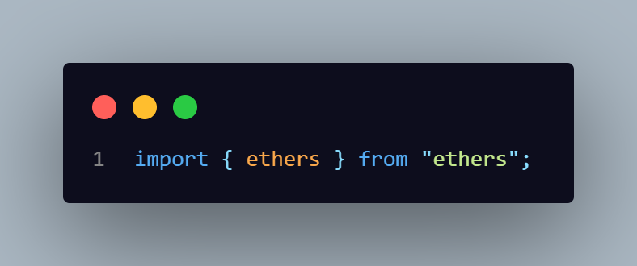
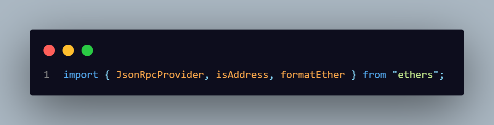

# Explicando os Erros que Encontrei e Soluções

## 1. Erros com Importações no `app.ts`

Ao iniciar o projeto, encontrei alguns problemas ao tentar utilizar `import` em `app.ts`. A importação com `import` causou erros no `utils`. Alterando as declarações de `import` para `require`, os erros desapareceram.

- **Antes da solução:**
  

- **Depois da solução:**
  

## 2. Problemas com `package.json`

Ao tentar executar `npm run build` e `npm start`, encontrei erros que indicavam scripts ausentes no `package.json`:

- **Erro do npm**: **Missing script: "build"**
- **Erro do npm**: **Missing script: "start"**

Corrigi o `package.json` para incluir esses scripts:

- **Antes:**
  

- **Depois:**
  

## 3. Inconsistência de IDs no HTML e no `app.ts`

Ajustei os IDs no HTML e no `app.ts` para garantir consistência, evitando problemas de referência.

- **Antes:**
  

    
    
  

- **Depois:**
  

    
    
  

## 4. Problema de Compatibilidade com `ethers.js`

Após corrigir os IDs, encontrei um novo erro no `utils`. Identifiquei que era um problema de versão do `ethers.js`. Reinstalei o pacote com `@latest` e modifiquei o `tsconfig.json` para compatibilidade:

- **Antes do `tsconfig`**:
  

- **Depois**:
  

Ajustei `module` para `NodeNext` e adicionei `moduleResolution: nodenext`.

## Principais Mudanças Implementadas

### Importações

Para acessar `ethers` diretamente, alterei o método de importação:

- **Antes**:
  
- **Depois**:
  

### Provider

Substituí o provider fixo pelo `JsonRpcProvider`.

### Seleção de Rede

Adicionei um `<select>` no HTML para que o usuário possa escolher a rede.

### Busca de Transações

Modifiquei a busca de transações para usar a API do `etherscan.io`, substituindo o método `getHistory`.

### Paginação de Transações

Implementei uma funcionalidade para carregar 5 transações por vez, com p botão visualizar +5.

## Extras Implementados

- **Validação de Endereço**: Verifica se o endereço digitado é válido.
- **Exibição da Data da Transação**: A data da transação é exibida em formato legível.
- **Suporte a Múltiplas Redes**: A seleção de redes permite a escolha de Mainnet, Rinkeby, Ropsten e Kovan.
- **Paginação**: Paginação de 5 em 5 transações.
