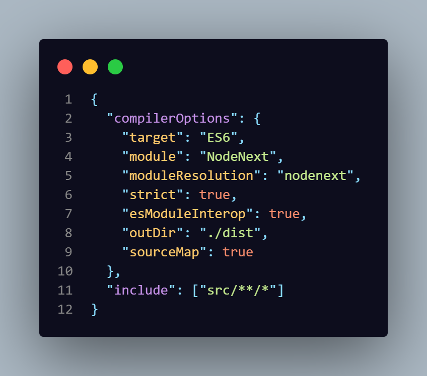

Explicando os erros que eu encontrei enquanto fazia o projeto e quais eu consegui resolver

ao copiar o codigo e tentar rodar tive erro no app.ts ao tentar rodar usando o import tive erros nos utils ao mudar do import para o require os erros dos utils sumiu .
o erro do tx era por ele nao ter tipo nenhum tipo declarado para from , value e to

entao o codigo saiu de imagem do trecho de codigo antes

codigo depoisa

apos resolver esses erros e tentar usar o npm run build e npm start entao atualizei o package.json e as bibliotecas,
o erro eram esses

<ul>
<li>npm <strong style="color:red;">error</strong> Missing script: "build"</li>
<li>npm <strong style="color:red;">error</strong> Missing script: "start"</li>
</ul>

fazendo com que o antes seja assim

depois

<h2>alterei os id no html e no app.ts para que eles ficassem iguais e funcionassem corretamente</h2>

<h3>Antes</h3>
 

 
 
<h3>Depois</h3>
 

porem depois de fazer isso ao tentar usar o input ou os botoes o erro do utils voltou a aparecer e como nao consegui resolver e nao achei alguma explicação pelo google , eu usei a ia indicada pelo professor 
e aparentemente era um erro de versao do ethers(ai eu desisntalei e intalei todos os pacotes usando @latest) e a forma com que o tsconfig estava configurado no inicio ele estava configgurado para 

E alterei as linhas para que ficassem assim

mudando o module para NodeNext e adicionei o  moduleResolution nodenext ai a compatiibilidade ficou melhor 

pos isso eu novamente mudei o app.ts pois a forma que o ether atualizado funciona era diferente do inicio 