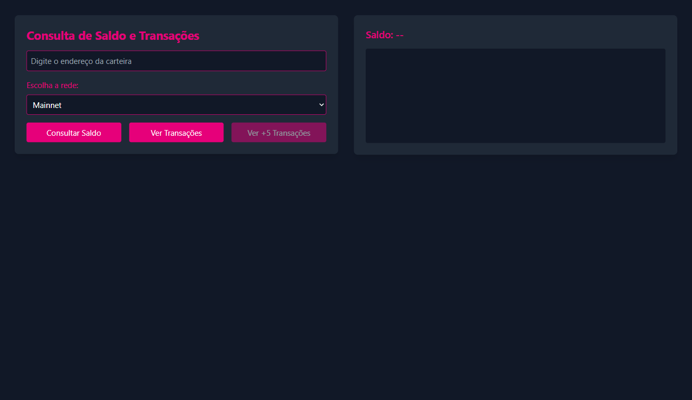
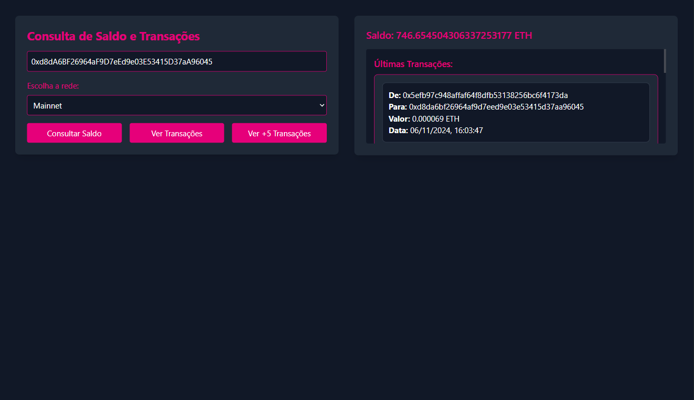

Este  é um projeto prático da aula do Código Brazuca de TypeScript com Ethers.js .

## Imagens do Projeto

### Projeto Vazio

 

### Projeto com Dados Preenchidos

 

## Como Executar

1. Clone o repositório.
2. Instale as dependências com `npm install`.
3. Execute o projeto com `npm start`.
